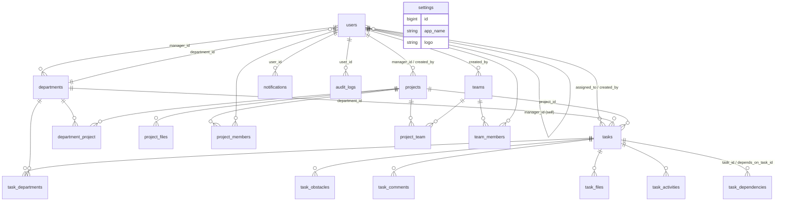

<div align="center">


# 04 — توثيق قاعدة البيانات
### Qurtuba Project Tracker · Database Documentation
<sub>الإصدار 1.0.0 · 2026-07-05 · Quantum Dev Team</sub>
</div>

---

## 1. نظرة عامة

- **المحرّك:** MySQL / MariaDB · **الترميز:** `utf8mb4`.
- **الترحيلات:** 22 ملفًا في `database/migrations/`.
- **الجداول التطبيقية:** 19 جدولًا (عدا جداول Laravel النظامية: `migrations`, `password_reset_tokens`, `failed_jobs`, `personal_access_tokens`).
- **العمود المحوري:** كل شيء يدور حول `users` و`projects` و`tasks`.
- **المفاتيح الأساسية:** كل الجداول لها `id` من نوع `BIGINT UNSIGNED AUTO_INCREMENT`.
- **الطوابع الزمنية:** معظم الجداول لها `created_at` / `updated_at` (باستثناء `audit_logs` — `created_at` فقط).

> جميع البيانات أدناه مُستخرَجة مباشرةً من `information_schema` بعد ترحيل نظيف.

---

## 2. مخطط العلاقات (ER Diagram)



> لعرض المخطط: افتح هذا الملف في محرّر يدعم Mermaid (GitHub, VS Code + إضافة Mermaid)، أو في نسخة HTML المُولّدة.

### خريطة المفاتيح الأجنبية (من الكود الفعلي)

| الجدول | العمود | يشير إلى |
|---|---|---|
| users | department_id | departments.id |
| users | manager_id | users.id (ذاتي) |
| departments | manager_id | users.id |
| projects | created_by, manager_id | users.id |
| tasks | project_id | projects.id |
| tasks | department_id | departments.id |
| tasks | assigned_to, created_by | users.id |
| task_departments | task_id / department_id | tasks.id / departments.id |
| task_dependencies | task_id / depends_on_task_id | tasks.id (ذاتي) |
| task_obstacles | task_id / assigned_to | tasks.id / users.id |
| task_comments | task_id / user_id | tasks.id / users.id |
| task_activities | task_id / user_id | tasks.id / users.id |
| task_files | task_id / uploaded_by | tasks.id / users.id |
| project_files | project_id / uploaded_by | projects.id / users.id |
| project_members | project_id / user_id | projects.id / users.id |
| project_team | project_id / team_id | projects.id / teams.id |
| department_project | project_id / department_id | projects.id / departments.id |
| teams | created_by | users.id |
| team_members | team_id / user_id | teams.id / users.id |
| notifications | user_id | users.id |
| audit_logs | user_id | users.id |

---

## 3. الجداول التطبيقية بالتفصيل

### 3.1 `users` — المستخدمون
حسابات النظام (الأدمن/المدراء/الموظفون).

| العمود | النوع | Null | مفتاح | افتراضي | الوصف |
|---|---|---|---|---|---|
| id | bigint unsigned | لا | PK | | المعرّف |
| name | varchar(255) | لا | | | الاسم |
| email | varchar(255) | لا | UNIQUE | | البريد (اسم الدخول) |
| phone | varchar(255) | نعم | | | الهاتف/تواصل |
| job_title | varchar(255) | نعم | | | المسمّى الوظيفي |
| department_id | bigint unsigned | نعم | FK | | القسم |
| manager_id | bigint unsigned | نعم | FK(ذاتي) | | المدير المباشر |
| avatar | varchar(255) | نعم | | | مسار الصورة |
| email_verified_at | timestamp | نعم | | | تحقّق البريد |
| password | varchar(255) | لا | | | كلمة المرور (Hash) |
| role | varchar(255) | لا | | `user` | `admin`/`manager`/`user` |
| is_active | tinyint(1) | لا | | 1 | تفعيل الدخول |
| remember_token | varchar(100) | نعم | | | تذكّرني |
| created_at/updated_at | timestamp | نعم | | | |

### 3.2 `departments` — الأقسام
| العمود | النوع | Null | مفتاح | الوصف |
|---|---|---|---|---|
| id | bigint unsigned | لا | PK | المعرّف |
| name | varchar(255) | لا | | اسم القسم |
| code | varchar(255) | نعم | | رمز القسم |
| description | text | نعم | | الوصف |
| manager_id | bigint unsigned | نعم | FK→users | مدير القسم |
| created_at/updated_at | timestamp | نعم | | |

### 3.3 `projects` — المشاريع
| العمود | النوع | Null | مفتاح | افتراضي | الوصف |
|---|---|---|---|---|---|
| id | bigint unsigned | لا | PK | | |
| name | varchar(255) | لا | | | اسم المشروع |
| description | text | نعم | | | الوصف |
| status | varchar(255) | لا | | `pending` | الحالة |
| priority | varchar(255) | لا | | `medium` | الأولوية |
| progress | tinyint unsigned | لا | | 0 | نسبة الإنجاز 0–100 |
| start_date | date | نعم | | | البداية |
| end_date | date | نعم | | | النهاية |
| created_by | bigint unsigned | لا | FK→users | | المنشئ |
| manager_id | bigint unsigned | نعم | FK→users | | مدير المشروع |
| created_at/updated_at | timestamp | نعم | | | |

### 3.4 `tasks` — المهام (الجدول الأغنى)
| العمود | النوع | Null | افتراضي | الوصف |
|---|---|---|---|---|
| id | bigint unsigned | لا | | |
| title | varchar(255) | لا | | عنوان المهمة |
| description | text | نعم | | الوصف |
| status | varchar(255) | لا | `pending` | الحالة |
| priority | varchar(255) | لا | `medium` | الأولوية |
| progress | tinyint unsigned | لا | 0 | نسبة الإنجاز |
| start_date | date | نعم | | البداية |
| due_date | date | نعم | | الاستحقاق (يحدّد التأخير) |
| estimated_hours | decimal(6,2) | نعم | | ساعات تقديرية |
| actual_hours | decimal(6,2) | نعم | | ساعات فعلية |
| delay_reason | text | نعم | | سبب التأخير |
| delay_needs_support | tinyint(1) | لا | 0 | يحتاج دعمًا |
| delay_needs_approval | tinyint(1) | لا | 0 | يحتاج اعتمادًا |
| delay_needs_budget | tinyint(1) | لا | 0 | يحتاج ميزانية |
| delay_needs_decision | tinyint(1) | لا | 0 | يحتاج قرارًا |
| obstacles | text | نعم | | عوائق (نص حر) |
| potential_risks | text | نعم | | مخاطر محتملة |
| notes | text | نعم | | ملاحظات |
| project_id | bigint unsigned | لا | FK→projects | المشروع |
| department_id | bigint unsigned | نعم | FK→departments | القسم الرئيسي |
| assigned_to | bigint unsigned | نعم | FK→users | المسؤول |
| created_by | bigint unsigned | لا | FK→users | المنشئ |
| created_at/updated_at | timestamp | نعم | | |

### 3.5 `task_departments` — الأقسام المعنية بالمهمة
| العمود | النوع | Null | افتراضي | الوصف |
|---|---|---|---|---|
| id | bigint unsigned | لا | | |
| task_id | bigint unsigned | لا | FK→tasks | المهمة |
| department_id | bigint unsigned | لا | FK→departments | القسم |
| responsibility | varchar(255) | لا | `primary` | نوع المسؤولية (primary/execution/financial/advisory/approval/support) |
| note | text | نعم | | ملاحظة |
| created_at/updated_at | timestamp | نعم | | |

### 3.6 `task_dependencies` — اعتماديات المهام (ذاتي)
| العمود | النوع | الوصف |
|---|---|---|
| id | bigint unsigned | |
| task_id | bigint unsigned FK→tasks | المهمة التابعة |
| depends_on_task_id | bigint unsigned FK→tasks | المهمة التي يجب إنهاؤها أولًا |
| created_at/updated_at | timestamp | |

### 3.7 `task_obstacles` — العوائق
| العمود | النوع | Null | افتراضي | الوصف |
|---|---|---|---|---|
| id | bigint unsigned | لا | | |
| task_id | bigint unsigned | لا | FK→tasks | المهمة |
| occurred_on | date | نعم | | تاريخ الحدوث |
| type | varchar(255) | نعم | | النوع |
| description | text | لا | | الوصف |
| impact | varchar(255) | لا | `medium` | الأثر |
| assigned_to | bigint unsigned | نعم | FK→users | المسؤول عن الحل |
| status | varchar(255) | لا | `open` | الحالة |
| created_at/updated_at | timestamp | نعم | | |

### 3.8 `task_comments` — التعليقات
`id`, `task_id` (FK), `user_id` (FK), `body` (text), `created_at/updated_at`.

### 3.9 `task_activities` — السجل الزمني للمهمة
`id`, `task_id` (FK), `user_id` (FK, nullable), `event` (varchar), `description` (text), `created_at/updated_at`. يُملأ تلقائيًا عبر `TaskObserver`.

### 3.10 `task_files` — مرفقات المهام
`id`, `task_id` (FK), `file_path`, `file_name`, `uploaded_by` (FK→users), timestamps.

### 3.11 `project_files` — ملفات المشاريع
`id`, `project_id` (FK), `file_path`, `file_name`, `uploaded_by` (FK→users), timestamps.

### 3.12 `project_members` — أعضاء المشروع (Pivot غني)
`id`, `user_id` (FK), `project_id` (FK), `role` (default `member`), `joined_at` (default الآن), timestamps.

### 3.13 `project_team` — ربط المشاريع بالفرق (Pivot)
`id`, `project_id` (FK), `team_id` (FK), timestamps.

### 3.14 `department_project` — ربط الأقسام بالمشاريع (Pivot)
`id`, `project_id` (FK), `department_id` (FK), timestamps.

### 3.15 `teams` — الفرق
`id`, `name`, `description` (text), `created_by` (FK→users), timestamps.

### 3.16 `team_members` — أعضاء الفريق (Pivot غني)
`id`, `user_id` (FK), `team_id` (FK), `role` (default `member`), `joined_at` (default الآن), timestamps.

### 3.17 `notifications` — الإشعارات
`id`, `user_id` (FK), `title`, `message` (text), `is_read` (bool, default 0), timestamps.

### 3.18 `audit_logs` — سجل التدقيق
| العمود | النوع | الوصف |
|---|---|---|
| id | bigint unsigned | |
| user_id | bigint unsigned FK→users (nullable) | من نفّذ الإجراء |
| event | varchar(255) | created/updated/deleted |
| auditable_type | varchar(255) | صنف النموذج (فهرس مركّب مع auditable_id) |
| auditable_id | bigint unsigned | معرّف السجل المتأثّر |
| description | varchar(255) | وصف مقروء |
| changes | longtext (JSON) | الحقول المتغيّرة (يُخفى password/remember_token) |
| created_at | timestamp | الوقت (لا `updated_at`) |

### 3.19 `settings` — إعدادات الهوية (صف واحد)
| العمود | النوع | افتراضي | الوصف |
|---|---|---|---|
| id | bigint unsigned | | |
| app_name | varchar(255) | «نظام إدارة المشاريع» | اسم النظام/الشركة |
| primary_color | varchar(255) | `indigo` | اللون الأساسي |
| sidebar_theme | varchar(255) | `light` | نمط السايد بار |
| logo | varchar(255) | NULL | مسار الشعار |
| created_at/updated_at | timestamp | | |

---

## 4. الجداول النظامية (Laravel)

`migrations` (تتبّع الترحيلات)، `password_reset_tokens` (إعادة تعيين كلمة المرور)، `failed_jobs` (المهام الفاشلة)، `personal_access_tokens` (رموز Sanctum). قياسية ولا يعدّلها النظام.

---

## 5. الفهارس (Indexes)

- **مفاتيح أساسية** على `id` في كل الجداول.
- **فهرس فريد** على `users.email`.
- **فهارس المفاتيح الأجنبية** (تُنشأ تلقائيًا مع قيود FK) على كل أعمدة `*_id` المذكورة أعلاه.
- **فهرس مركّب** على `audit_logs(auditable_type, auditable_id)` للاستعلام السريع عن سجل كيان معيّن.

> **توصية:** لأداء أفضل مع نمو البيانات، أضِف فهارس على `tasks.status`, `tasks.department_id`, `tasks.due_date` (الأعمدة الأكثر فلترةً في الجداول والتقارير).

---

## 6. إعادة توليد المخطط

```bash
# ترحيل نظيف على قاعدة اختبار (لا تستخدم قاعدة الإنتاج)
DB_DATABASE=qurtuba_test php artisan migrate:fresh --force

# استخراج البنية
mysqldump -uroot --no-data qurtuba_test > schema.sql
```

---

<div align="center"><sub>© Quantum Dev Team — CODE BEYOND BOUNDARIES</sub></div>
