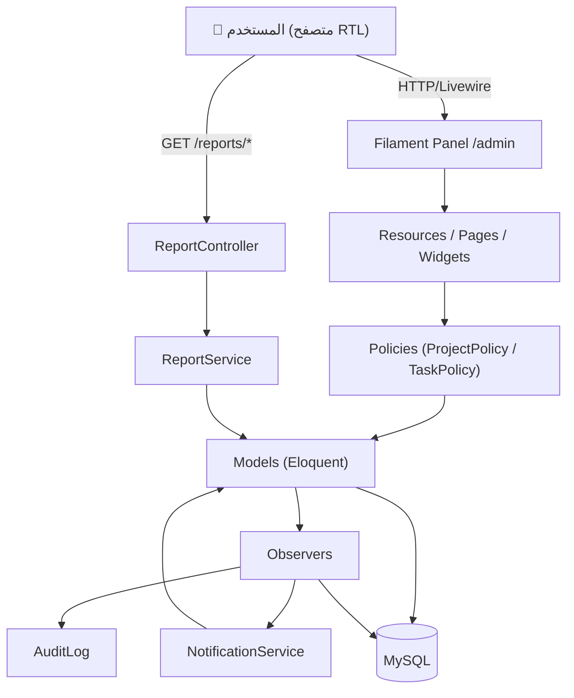
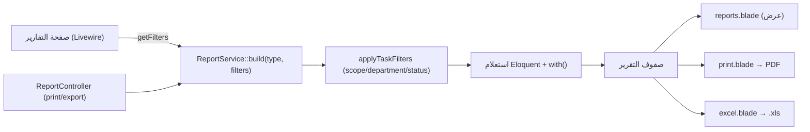
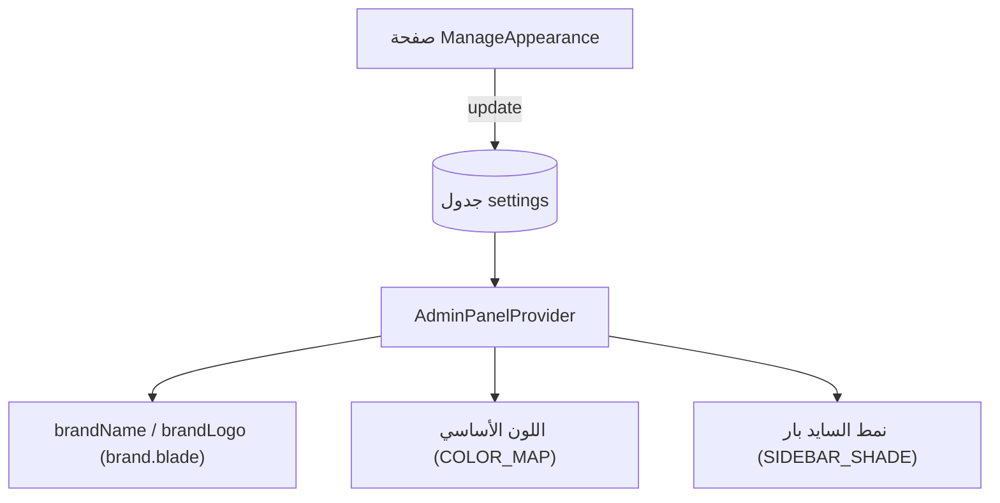
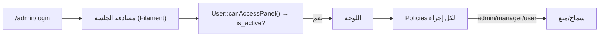

<div align="center">


# 07 — معمارية النظام
### Qurtuba Project Tracker · System Architecture
<sub>الإصدار 1.0.0 · 2026-07-05 · Quantum Dev Team</sub>
</div>

---

## 1. النمط المعماري

النظام يتّبع نمط **Server-Driven UI** عبر **Filament + Livewire** فوق **معمارية Laravel الطبقية (MVC موسّعة بالخدمات والمراقبات)**. لا توجد واجهة أمامية منفصلة (SPA)؛ الواجهة تُبنى على الخادم وتُحدَّث تفاعليًا عبر Livewire.

**الطبقات:**
```
Presentation  →  Filament (Resources / Pages / Widgets) + Blade
Authorization →  Policies + canAccess()
Domain        →  Models (Eloquent) + خصائص محسوبة
Reactions     →  Observers (Audit / Task / Comment / Department)
Services      →  NotificationService / ReportService
Persistence   →  Eloquent ORM → MySQL
```

---

## 2. تدفّق البيانات (Frontend → Database)



**شرح المسار الرئيسي:**
1. المستخدم يتفاعل مع صفحة Filament (Livewire يرسل الحالة للخادم).
2. المورد/الصفحة يتحقّق من الصلاحية عبر **Policy** ثم يستدعي **Model**.
3. حفظ النموذج يطلق أحداث Eloquent → تلتقطها **Observers**:
   - `AuditObserver` يكتب في `audit_logs`.
   - `TaskObserver` يكتب `task_activities` ويستدعي `NotificationService`.
4. **Services** تنفّذ منطق الأعمال المتقاطع (إشعارات/تقارير).
5. **Eloquent** يثبّت كل شيء في **MySQL**.

---

## 3. مسار طلب التقرير



---

## 4. معمارية الهوية الديناميكية


`AdminPanelProvider` يقرأ `Setting::current()` عند كل إقلاع لبناء الهوية؛ صفحة «إعدادات المظهر» تكتب في نفس الجدول → تغيّر فوري للهوية دون كود.

---

## 5. المصادقة والتفويض



- **المصادقة:** جلسة قائمة على Cookies.
- **بوابة الدخول:** `is_active = true`.
- **التفويض:** `ProjectPolicy` / `TaskPolicy` + `canAccess()` في الصفحات الحسّاسة (مثل `ManageAppearance` و`AuditLog` للأدمن فقط).

---

## 6. الطبقات ومسؤولياتها (مرجع سريع)

| الطبقة | المجلد | المسؤولية | لا يجب أن يحتوي |
|---|---|---|---|
| العرض | `app/Filament`, `resources/views` | بناء الواجهة والتفاعل | منطق أعمال ثقيل |
| التفويض | `app/Policies` | من يستطيع ماذا | استعلامات معقّدة |
| المجال | `app/Models` | البيانات + العلاقات + الخصائص المحسوبة | إرسال إشعارات/HTTP |
| التفاعلات | `app/Observers` | ردود فعل تلقائية على أحداث النماذج | عرض/HTML |
| الخدمات | `app/Services` | منطق متقاطع قابل لإعادة الاستخدام | حالة واجهة |
| الثبات | Migrations + Eloquent | تخزين البيانات | — |

---

## 7. النشر (منظور معماري)

```mermaid
flowchart LR
    GH["GitHub (main)"] --> RW["Railway (Nixpacks)"]
    RW --> BUILD["setup: php82+composer / install / (no npm)"]
    BUILD --> START["railway-start.sh"]
    START --> WAIT["انتظار DB"]
    WAIT --> MIG["migrate + ProductionSeeder"]
    MIG --> CACHE["storage:link + filament:assets + caches"]
    CACHE --> SERVE["php artisan serve :PORT"]
    SERVE --> PROXY["وكيل HTTPS (TrustProxies=*)"]
    PROXY --> USER["👤"]
```



التفاصيل الكاملة في [دليل النشر](06-Deployment-Guide.md).

---

<div align="center"><sub>© Quantum Dev Team — CODE BEYOND BOUNDARIES</sub></div>
